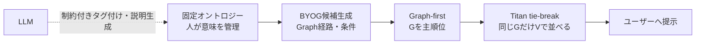
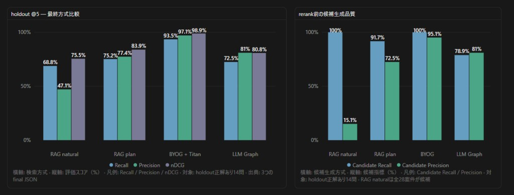
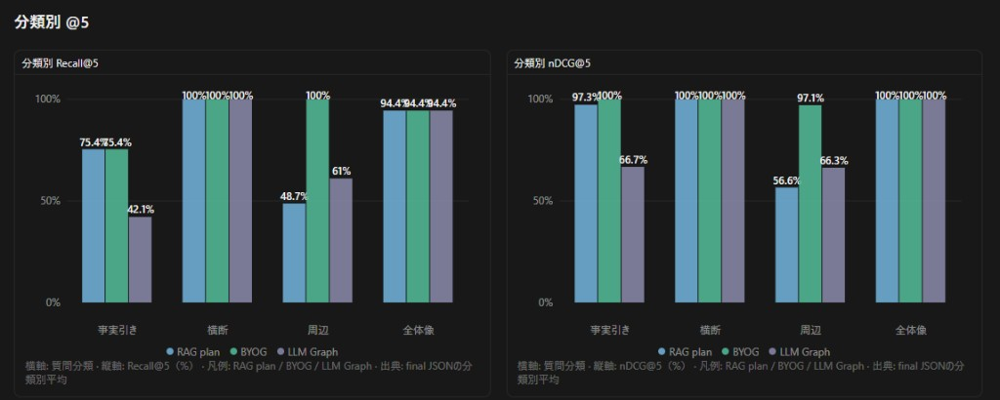

# GraphRAG PoC 最終比較

更新日: 2026-08-31

## 1. 結論

固定オントロジーのBYOGで候補とGraph関連度を決め、同じGraphスコアの候補だけTitanで並べる構成を採用候補とする。

- BYOG + Titan tie-breakは、holdoutのRecall@5 93.5%、Precision@5 97.1%、nDCG@5 98.9%
- LLM生成Graphは、意味ノード検索、relation正規化、最大4hopへ調整してもRecall@5 72.5%、Precision@5 81.0%、nDCG@5 80.8%
- 主目的の周辺検索では、BYOGのRecall@5 100%に対し、LLM生成Graphは61.0%、RAG planは48.7%
- LLM生成Graphは自由生成後のノード統合、relation正規化、探索深さ調整、回帰評価が必要で、固定BYOGより運用コストが高い
- LLM自体は不採用とせず、固定オントロジーへの制約付きタグ付け、未知概念候補、説明文生成に使う

## 2. 評価条件

- 案件: 合成28件
- 評価質問: holdout Q21-Q37
- 正解案件あり: 14問
- 該当なし: 3問
- k: 5 / 10 / 20
- 埋め込み: Amazon Titan Embeddings
- min-score: 0
- コミュニティ: summary-k 4
- LLM生成Graph: node-top-k 5、node-min-score 0.55、llm-max-hops 4
- 検索計画: `data/search_plans.draft.json`

holdoutは評価途中で結果確認と修正に使用しているため、厳密な未観測テストではない。同一条件での最終比較として扱う。

## 3. 全体結果

### 3.1 通常順位

| 方式 | k | Recall | Precision | F1 | nDCG | No-answer |
|---|---:|---:|---:|---:|---:|---:|
| RAG natural | 5 | 68.8% | 47.1% | 49.7% | 75.5% | 0% |
| RAG natural | 10 | 86.3% | 32.9% | 42.3% | 82.1% | 0% |
| RAG natural | 20 | 99.6% | 20.7% | 30.6% | 85.3% | 0% |
| RAG plan | 5 | 75.2% | 77.4% | 72.6% | 83.9% | 100% |
| RAG plan | 10 | 84.7% | 76.0% | 75.2% | 86.9% | 100% |
| RAG plan | 20 | 91.7% | 73.5% | 74.5% | 88.2% | 100% |
| BYOG + Titan | 5 | 93.5% | 97.1% | 93.4% | 98.9% | 100% |
| BYOG + Titan | 10 | 96.6% | 95.1% | 94.8% | 98.9% | 100% |
| BYOG + Titan | 20 | 100% | 95.1% | 97.0% | 98.9% | 100% |
| LLM Graph + Titan | 5 | 72.5% | 81.0% | 74.8% | 80.8% | 100% |
| LLM Graph + Titan | 10 | 75.5% | 81.0% | 77.4% | 80.8% | 100% |
| LLM Graph + Titan | 20 | 78.9% | 81.0% | 79.6% | 80.8% | 100% |

### 3.2 rerank前候補

| 方式 | Candidate Recall | Candidate Precision |
|---|---:|---:|
| RAG natural | 100% | 15.1% |
| RAG plan | 91.7% | 72.5% |
| BYOG | 100% | 95.1% |
| LLM生成Graph | 78.9% | 81.0% |

LLM生成GraphのCandidate Recall 78.9%とRecall@20 78.9%が一致している。主なボトルネックはTitanの順位ではなく、Graph候補に正解案件が入らないことである。

## 4. 分類別@5

| 分類 | 方式 | Recall@5 | Precision@5 | nDCG@5 |
|---|---|---:|---:|---:|
| 事実引き | RAG plan | 75.4% | 80.0% | 97.3% |
| 事実引き | BYOG | 75.4% | 100% | 100% |
| 事実引き | LLM生成Graph | 42.1% | 66.7% | 66.7% |
| 横断 | RAG plan | 100% | 83.3% | 100% |
| 横断 | BYOG | 100% | 100% | 100% |
| 横断 | LLM生成Graph | 100% | 100% | 100% |
| 周辺 | RAG plan | 48.7% | 58.7% | 56.6% |
| 周辺 | BYOG | 100% | 92.0% | 97.1% |
| 周辺 | LLM生成Graph | 61.0% | 66.7% | 66.3% |
| 全体像 | RAG plan | 94.4% | 100% | 100% |
| 全体像 | BYOG | 94.4% | 100% | 100% |
| 全体像 | LLM生成Graph | 94.4% | 100% | 100% |

横断と全体像ではLLM生成Graphも高精度だが、PoCの主目的である周辺・キャリアブリッジ検索ではBYOGとの差が大きい。

## 5. Graph-onlyとTitan tie-break

Graph-onlyは `global_summary` の3問を除いた正解あり11問であり、通常順位の14問平均とは母数が異なる。

| 方式 | k | Recall | Precision | F1 | nDCG |
|---|---:|---:|---:|---:|---:|
| BYOG Graph-only | 5 | 93.3% | 96.4% | 92.4% | 97.1% |
| BYOG Graph-only | 10 | 95.7% | 93.8% | 93.4% | 97.1% |
| BYOG Graph-only | 20 | 100% | 93.8% | 96.2% | 97.1% |
| LLM Graph-only | 5 | 66.5% | 75.8% | 68.8% | 75.6% |
| LLM Graph-only | 10 | 68.9% | 75.8% | 71.2% | 75.6% |
| LLM Graph-only | 20 | 73.2% | 75.8% | 74.1% | 75.6% |

BYOGの周辺質問ではTitan tie-breakによりnDCG@5が93.6%から97.1%へ改善する。候補集合とGraph関連度を維持したまま、同一G内の順位だけを改善できている。

## 6. 方式別の判断

### Vector RAG

- naturalはkを増やせばRecallが上がるが、Precisionが大きく下がる
- min-score 0では該当なし3問をすべて誤検出する
- planを与えると改善するが、周辺検索ではBYOGに届かない
- 比較用ベースラインと補助検索として残す

### BYOG

- 候補段階でRecall 100%、Precision 95.1%
- 周辺検索でRecall@5 100%、Precision@5 92.0%
- 固定オントロジーにより経路の意味と結果の再現性を管理できる
- Titanを主順位にせず、Graph同点内だけに使う構成が有効

### LLM生成Graph

- 全体像と横断は高精度
- 事実引きと周辺で候補漏れが残る
- ノードが案件ごとに細分化され、同義概念が別ノードになる
- relation表記、hop数、意味ノード解決、経路ノイズへの継続対応が必要
- API料金だけでなく、再生成後の品質確認と回帰評価の人的コストが大きい

## 7. 次の段階

1. 現在のBYOG + Titan tie-breakをPoC Aの採用構成として固定する
2. 実案件と新規ユーザー質問で再評価する
3. 自然文からSearchPlanを生成する能力を別評価する
4. 固定オントロジーへの制約付きAIタグ付けを検証する
5. 初期構築、差分更新、検索、レビュー工数を含むコストを測定する
6. 本番方式の最終採用は実データ結果を受けた後続ADRで決定する

## 8. 根拠ファイル

- [RAG holdout結果](../../data/eval_results/rag-holdout-final.json)
- [BYOG holdout結果](../../data/eval_results/byog-holdout-final.json)
- [LLM生成Graph holdout結果](../../data/eval_results/llm-holdout-final.json)
- [質問と正解](../../data/questions.csv)
- [検索計画](../../data/search_plans.draft.json)
- [検索方式とCLI引数](./検索方式とCLI引数.md)
- [評価方針ADR](../adr/0003-検索PoCの評価方針.md)
