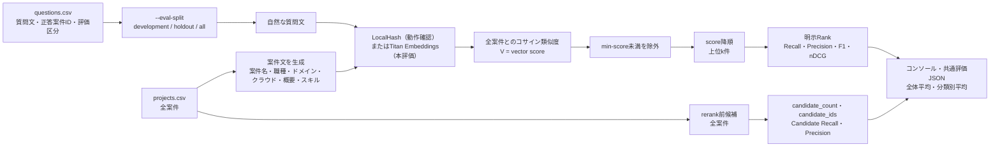
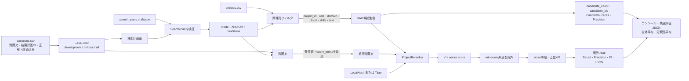
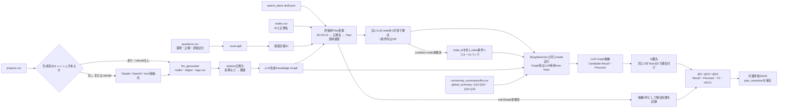
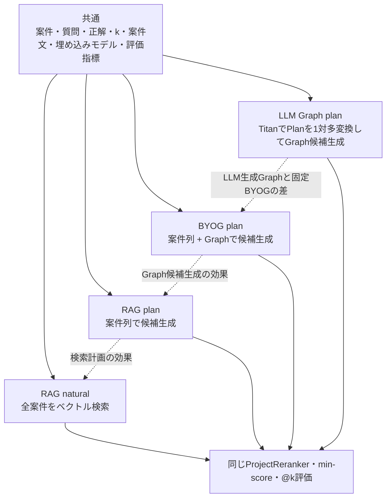

# 検索方式とCLI引数

この文書は、現在のPoCで利用できる検索方式、CLI引数による挙動の違い、検索できること・できないことを整理する。

対象：

- ベクトルRAG：`scripts/search_rag.py`
- BYOG GraphRAG：`scripts/build_graph_byog.py`
- LLM生成Graph：`scripts/build_graph_llm.py`
- コミュニティ要約：`scripts/summarize_communities.py`
- Graph可視化：`scripts/visualize_graph.py`

PoCの評価方針と判断基準は、`docs/poc/rag-vs-graphrag.md` と `docs/adr/0003-検索PoCの評価方針.md` を参照する。

## 1. 最初に理解する2つの切り替え

現在のCLIには、別々の目的を持つ2種類の切り替えがある。

### 1.1 検索計画を使うか

`--eval-mode` で決まる。

- `natural`：自然な質問文だけで検索する
- `plan`：`questions.csv` が参照する検索計画を使う
- `both`：naturalとplanを同じ質問で順番に評価する
- `legacy`：改修前のBYOG検索を使う

検索計画は `data/search_plans.draft.json` にあり、`data/questions.csv` の `検索計画` 列から計画IDを参照する。

### 1.2 どの埋め込みを使うか

RAGでは `--embedder`、BYOGのrerankでは `--reranker` で決まる。

- `local`：APIを使わない簡易ハッシュベクトル
- `bedrock`：Amazon Titan Embeddings
- `openai`：OpenAI Embeddings

`local / bedrock / openai` は検索計画の有無を変更しない。変更するのは、質問・案件・コミュニティ要約のベクトルと順位である。

## 2. APIなし確認と本評価の違い

### 2.1 APIなし確認

`local` は次を確認するために使う。

- CLIが起動する
- CSVと検索計画JSONを読み込める
- AND / ORが動く
- Graph探索が動く
- 評価指標を計算できる
- 共通JSONを出力できる
- 該当なし候補を空集合にできる

確認できないもの：

- 自然文の意味理解
- Titanによる実際の順位品質
- Titan用の `min-score`
- 本番相当のRAGとBYOGの精度差

LocalHashのスコア分布はTitanと異なるため、localで決めた `min-score` を本評価へ流用しない。

### 2.2 本評価

`bedrock` はTitanを使い、意味的な類似度で順位付けする。

本評価でも次はPythonが決定的に処理する。

- 検索計画のmode
- AND / OR
- 案件列フィルタ
- BYOGのタグ集合演算
- Graphの探索関係と最大hop数

Bedrockが検索計画を作るわけではない。現在のPoC Aでは、人が作成した検索計画をPythonが実行し、Titanは候補の順位付けだけを担当する。

## 処理アーキテクチャ

この節を、検索処理の実装順序に関する正本とする。検索候補の作り方、埋め込み、rerank、しきい値、評価出力の順序を変更した場合は、コードと同じ変更でこの節も更新する。

### ベクトルRAG：natural

`natural` は検索計画を使わない。全案件に対するベクトル順位付けそのものが検索である。



要点：

- 候補母集団は全案件
- LocalHashとTitanで変わるのはベクトルと順位
- `min-score`と`k`によって最終返却集合が決まる
- Graph、ノード、エッジ、検索計画は使わない

### ベクトルRAG：plan

`plan` は案件列で表現できる条件を先に適用し、残った候補をベクトルで順位付けする。Graphノードは探索には使わず、条件語として質問へ追加する。



要点：

- RAGが決定的に使うのは `projects.csv` の列条件
- `node_id`、`graph_expand`、`graph_bridge`でGraphを辿らない
- Graph概念の値は拡張質問文へ入り、ベクトル順位へ間接的に影響する
- RAG naturalとの差は、理想的な検索計画を与えた効果

### BYOG GraphRAG：plan

BYOGは検索計画とKnowledge Graphで候補を作り、候補内だけをベクトルでrerankする。

```mermaid
flowchart LR
    QCSV["questions.csv<br/>質問文・検索計画ID・正解・評価区分"] --> SPLIT["--eval-split<br/>development / holdout / all"]
    SPLIT --> PLANREF["検索計画ID"]
    PJSON["search_plans.draft.json"] --> PLAN["SearchPlanを検証<br/>既知node_id・relation・max_hops"]
    PLANREF --> PLAN

    NCSV["nodes.csv"] --> KG["KnowledgeGraph"]
    ECSV["edges.csv"] --> KG
    TCSV["tags.csv"] --> KG
    PCSV["projects.csv"] --> KG

    PLAN --> ROUTE{"mode"}
    ROUTE -->|exact・filter| FILTER["案件列条件・タグ条件<br/>AND / OR"]
    ROUTE -->|graph_expand| EXPAND["起点から双方向BFS<br/>relation・max_hops制限"]
    ROUTE -->|graph_bridge| BRIDGE["起点と目標から探索<br/>接続経路を抽出"]
    ROUTE -->|global_summary<br/>Q13-Q16・Q32-Q34| GLOBAL["コミュニティ要約をベクトル検索<br/>上位summary-k"]

    KG --> FILTER
    KG --> EXPAND
    KG --> BRIDGE
    KG --> CKIND["BYOGコミュニティ生成<br/>職種・業務ノードだけを使用"]
    CKIND --> CREL["包含・関連エッジだけを使用"]
    CREL --> LOUVAIN["Louvainで分割"]
    LOUVAIN --> CSUM["案件本文・skillsをClaudeで要約"]
    CSUM --> SUMMARY
    SUMMARY["community_summaries/byog.csv"] --> GLOBAL
    EMB1["LocalHash または Titan"] --> GLOBAL

    FILTER --> CAND["Graph候補集合"]
    EXPAND --> CAND
    BRIDGE --> CAND
    GLOBAL --> CAND

    CAND --> CANDMETRIC["rerank前<br/>candidate_count・candidate_ids<br/>Candidate Recall・Precision"]
    CAND --> REASON["G = graph score<br/>一致条件・理由・pathを保持"]
    REASON --> GRAPHONLY["Graph-only順位<br/>score = G<br/>global_summaryは対象外"]
    GRAPHONLY --> GMETRIC["Graph-only @k<br/>Recall・Precision・F1・nDCG"]
    SPLIT --> AUG["質問文 + 条件値 + query_terms"]
    REASON --> RERANK["ProjectReranker<br/>候補案件のVを計算"]
    AUG --> RERANK
    EMB2["LocalHash または Titan"] --> RERANK
    RERANK --> MIN["Vがmin-score未満の案件を除外"]
    MIN --> POLICY{"検索mode"}
    POLICY -->|exact・filter・graph_expand・graph_bridge| GFIRST["G降順を優先<br/>同じGの中をV降順"]
    POLICY -->|global_summary・natural| VONLY["V降順"]
    GFIRST --> SCORE["Graph-first順位"]
    VONLY --> SCORE["Vector順位"]
    SCORE --> TOPK["順位の上位k件"]
    TOPK --> METRIC["明示Rank<br/>Recall・Precision・F1・nDCG"]
    CANDMETRIC --> OUT["コンソール・共通評価JSON<br/>全体平均・分類別平均"]
    GMETRIC --> OUT
    METRIC --> OUT
```



要点：

- `exact / filter / graph_expand / graph_bridge` の候補生成はLocalHashとTitanで変わらない
- `global_summary` は埋め込みで上位コミュニティを選ぶため、LocalHashとTitanで候補集合も変わり得る
- 「全体像」に分類したQ13-Q16・Q32-Q34は `global_summary` とし、分類と検索経路を一致させる
- Graph候補から漏れた案件をrerankで復活させることはできない
- 通常順位はGを優先し、同じGの候補内をVで並べる。Graph-only順位はVを使わない比較用として併記する
- rerank前候補とrerank後順位を別々に評価するため、検索漏れと順位不良を切り分けられる
- RAG planとの差は、Graphのタグ・エッジ・経路を候補生成に使った効果

### LLM生成Graph：plan評価

LLM生成Graphは、Graph構築時にLLMを使うが、検索時にLLM推論はしない。plan評価ではRAG / BYOGと同じ質問、検索計画、Titan、k、評価指標、JSON形式を使う。



Plan変換は評価時だけBYOGの `nodes.csv` をIDと正規名の対応表として使い、語彙の包含一致とTitan類似度で複数のLLMノードへ解決する。複数ノードは同じ条件内ではOR、他条件とはPlanのAND / ORを維持する。完全自律のLLM Graphには存在しない意味合わせなので、`plan_resolution` として解決・部分解決・未解決を記録し、比較結果で明示する。

従来の「質問に含まれるノード名を文字列一致し、全relationを双方向走査する」処理は `--eval-mode legacy` と単発 `--query` に残す。

### 比較時に揃う部分・異なる部分



## 3. ベクトルRAG

対象スクリプト：

```powershell
python scripts/search_rag.py
```

案件文は、次の列を連結した文章である。

```text
案件名 + 想定職種 + ドメイン + クラウド + 案件概要 + 必要スキル
```

### 3.1 単発の自然文検索

```powershell
python scripts/search_rag.py --query "Kubernetes上でモデルを配信する案件" --embedder bedrock --k 5
```

処理：

```text
全案件
→ 案件文と質問をベクトル化
→ コサイン類似度
→ min-score未満を除外
→ 上位k件
```

検索できること：

- 質問と意味的に近い案件
- 案件文に表現揺れがある検索
- 明示的なタグがない概念の類似検索

検索できない、または保証できないこと：

- 複数条件の厳密なAND
- 案件IDや職種の完全一致だけを必ず返すこと
- 「含まない」などの否定条件
- 職種間のGraph経路
- なぜその案件へ到達したかというGraph上の説明

### 3.2 natural一括評価

```powershell
python scripts/search_rag.py --eval --eval-mode natural --embedder bedrock --ks 5,10,20
```

`questions.csv` の質問文だけを使い、全案件を順位付けする。検索計画は使わない。

用途：

- 素のベクトルRAGの基準値
- 検索計画を与えなくても意味検索だけでどこまで届くかの確認

### 3.3 plan一括評価

```powershell
python scripts/search_rag.py --eval --eval-mode plan --embedder bedrock --ks 5,10,20
```

処理：

```text
検索計画を読み込む
→ projects.csvで表現できる条件を決定的に適用
→ 検索計画の条件語を質問へ追加
→ 残った候補をベクトル順位付け
```

RAGで決定的に適用できる条件：

- `project_id`
- `role`
- `domain`
- `cloud`
- `skills`
- `text`

RAGで決定的なGraph条件として適用しないもの：

- 業務ノード
- Graphの包含・関連
- `graph_expand`
- `graph_bridge`

検索計画内のGraph概念は質問の補足語には使われるが、RAGがGraphを辿るわけではない。

### 3.4 both一括評価

```powershell
python scripts/search_rag.py --eval --eval-mode both --embedder bedrock --ks 5,10,20
```

同じ20問に対して次を両方実行する。

1. RAG natural
2. RAG plan

この差は、理想的な検索計画を与えた効果を表す。

## 4. BYOG GraphRAG

対象スクリプト：

```powershell
python scripts/build_graph_byog.py
```

BYOGは次を使う。

- `data/nodes.csv`
- `data/edges.csv`
- `data/tags.csv`
- `data/projects.csv`
- `data/search_plans.draft.json`

### 4.1 手動の周辺確認

```powershell
python scripts/build_graph_byog.py --start N_JOB_MLOPS
```

指定ノードから `包含 / 関連` を辿り、到達ノードと案件を表示する。

これはデバッグ用であり、次は行わない。

- Titan rerank
- `k`による順位評価
- 検索計画
- nDCG
- `min-score`

### 4.2 legacy評価

```powershell
python scripts/build_graph_byog.py --eval --eval-mode legacy
```

改修前の検索方式である。質問文に含まれるノード名を文字列一致し、複数起点の案件集合を和集合で返す。

用途：

- 過去の評価結果との互換比較
- 改修前後の回帰確認

本評価に使わない理由：

- 複数条件を厳密にANDできない
- Graph結果に意味的な順位がない
- RAGと同じkに揃わない
- nDCGがない
- 共通JSON出力ではない

注意：`build_graph_byog.py --eval` だけを実行した場合、デフォルトは `legacy` である。検索計画を使いたい場合は必ず `--eval-mode plan` を指定する。

### 4.3 plan評価

```powershell
python scripts/build_graph_byog.py --eval --eval-mode plan --reranker bedrock --ks 5,10,20
```

処理：

```text
検索計画
→ 案件列条件・BYOGタグ条件
→ AND / OR
→ 必要ならGraph探索
→ 候補案件
→ Titanで候補内をrerank
→ 上位k件
```

Graphは候補を作り、Titanは候補の順番を決める。現在の最終 `score` はvector scoreであり、graph scoreは順位へ加算せず、検索理由として保持する。

評価時は、rerank前候補のRecall / Precisionと、Graph-first＋V同点解消後の順位を分離して出力する。さらに比較用として、同じ候補をGだけで並べたGraph-only順位も出力する。これにより「Graphが候補から落とした」のか「同じGraph関連度の中でVが順位を改善したか」を切り分ける。`global_summary` は案件ごとのGを持たないためVだけで順位付けする。

検索できること：

- 職種・業務・スキルタグの完全一致
- 複数タグと案件列のAND / OR
- 周辺業務の展開
- 職種間をつなぐ業務ノード
- 検索に使った条件とGraph経路
- Graph候補内の意味的な順位

検索できない、または保証できないこと：

- オントロジーに存在しない概念
- `tags.csv` に付いていない案件
- Graph候補から漏れた案件をTitanで救うこと
- 間違った検索計画を検索中に自動修正すること
- 現在の空き、参画可能性、個人との適合度

### 4.4 both評価

```powershell
python scripts/build_graph_byog.py --eval --eval-mode both --reranker bedrock
```

legacy評価の後にplan評価を実行する。共通JSONとして保存されるのはplan評価だけである。

## 5. 検索計画mode

### 5.1 `exact`

用途：

- 案件ID
- 職種
- スキル
- 明確な単一条件

できること：

- 完全一致に近い候補集合を作る
- 周辺案件を不用意に追加しない

できないこと：

- 曖昧なキャリア相談
- 複数職種をまたぐ経路探索

### 5.2 `filter`

用途：

- Python AND 金融
- Kubernetes AND モデル配信
- 複数条件のOR

BYOGでは `node_id` がある条件を案件タグで評価し、それ以外をprojects.csvの列で評価する。

できないこと：

- 括弧を持つ複雑な条件式
- `A AND (B OR C)` のようなネスト

現在のoperatorは、条件全体に対する単一の `AND` または `OR` である。

### 5.3 `graph_expand`

用途：

- 起点業務から周辺業務を広く取得
- MLOps周辺の関連案件

主要パラメータ：

- `start_node_ids`
- `relations`
- `max_hops`

できないこと：

- 起点ノードが存在しない検索
- タグのない案件の取得
- Graph外の意味的な補完

hopを増やすとRecallは上がりやすいが、候補が広がりPrecisionが下がりやすい。

### 5.4 `graph_bridge`

用途：

- インフラエンジニアからMLOps
- データエンジニアからMLOps
- ソフトウェアエンジニアからMLOps

主要パラメータ：

- `start_node_ids`
- `target_node_ids`
- `relations`
- `max_hops`

起点と目標の両方から探索し、最大hop内で接続できる共通ノードを候補理由にする。

できないこと：

- Graphに経路がない職種間接続
- 経路の業務的妥当性を検索時にLLMが判断すること
- 最短経路が必ず唯一であること

### 5.5 `global_summary`

用途：

- 案件群全体の傾向
- よく出る業務・スキル
- 職種間の重なり

処理：

```text
コミュニティ要約
→ 質問とのベクトル類似度
→ 上位summary-kコミュニティ
→ 含まれる案件
→ 案件をrerank
```

できないこと：

- 案件IDの厳密な事実引き
- 要約に含まれなかった細部の保証
- コミュニティ分割で離れた案件の救済

`summary-k`を増やすと候補が増え、Recallが上がりやすい一方でPrecisionが下がりやすい。

## 6. RAG CLI引数

### `--data-dir`

入力CSVのディレクトリ。デフォルトは `data/`。

### `--query`

単発の自然文検索。検索計画は使わない。

### `--eval`

`questions.csv` を一括評価する。

### `--eval-mode natural|plan|both`

一括評価で検索計画を使うかを決める。デフォルトは `natural`。

### `--eval-split development|holdout|all`

`questions.csv` の `評価区分` で評価対象を分ける。デフォルトは `all`。調整済みのQ01〜Q20は `development`、未使用のQ21〜Q37は `holdout` として集計を混ぜない。

### `--embedder local|bedrock|openai`

ベクトル生成方式。デフォルトは `local`。

### `--k`

`--query` の返却件数。デフォルトは10。

一括評価では `--k` ではなく `--ks` を使う。

### `--ks 5,10,20`

一括評価するkの一覧。順序と重複は正規化される。

### `--plans`

`data-dir` 配下の検索計画JSON名。デフォルトは `search_plans.draft.json`。

### `--min-score`

コサイン類似度がこの値未満の案件を返さない。デフォルトは0.0。

高くするとノイズを減らせるが、正解案件も落とす可能性がある。Titan用の値は、最終評価とは別の調整用質問で固定する。

### `--no-cache`

埋め込みキャッシュを使わない。同じ案件・質問でもAPIを再実行するため、本評価で常用しない。

### `--output`

評価結果を共通JSONで保存する。

```powershell
--output data/eval_results/rag.json
```

各質問に、rerank前の `candidate_count / candidate_ids / candidate_recall / candidate_precision`、明示的な `rank` を持つhits、@k指標を保存する。summaryには全体平均と分類別平均を保存する。

## 7. BYOG CLI引数

### `--data-dir`

BYOG、案件、質問、検索計画を置くディレクトリ。

### `--start`

デバッグ用の起点ノードID。plan評価とは別経路。

### `--eval`

`questions.csv` の質問を一括評価する。

### `--eval-split development|holdout|all`

`questions.csv` の `評価区分` で評価対象を分ける。デフォルトは `all`。最終比較では `holdout` を明示する。

### `--eval-mode legacy|plan|both`

デフォルトは `legacy`。本評価では `plan` を明示する。

### `--reranker local|bedrock|openai`

Graph候補を順位付けする埋め込み方式。デフォルトは `bedrock`。

`legacy`だけを実行する場合は使用されない。

### `--ks`

plan評価のk一覧。デフォルトは `5,10,20`。

### `--plans`

検索計画JSON名。デフォルトは `search_plans.draft.json`。

### `--summary-k`

`global_summary` で参照するコミュニティ数。デフォルトは3。

### `--min-score`

Graph候補をrerankした後、しきい値未満の案件を落とす。

Graphの候補生成前には適用されない。Graphが落とした案件を復活させる機能でもない。

### `--no-cache`

案件・質問・コミュニティ要約の埋め込みキャッシュを使わない。

### `--output`

plan評価を共通JSONで保存する。

```powershell
--output data/eval_results/byog.json
```

RAGと同じ候補・rank・@k出力に加え、`graph_only_hits / graph_only_metrics` を保存する。Graph-onlyはGだけの比較順位であり、`global_summary`にはGraph距離スコアがないため対象外とする。

## 8. LLM生成Graph

対象スクリプト：

```powershell
python scripts/build_graph_llm.py
```

これは「検索時にLLMが推論する方式」ではない。

```text
案件文
→ LLMが事前にノード・エッジ・タグを生成
→ CSVへ保存
→ 検索時はPythonがGraphを走査
```

### legacyで検索できること

- 質問文に名前が含まれるノードを起点にする
- 全関係を双方向に辿る
- 到達ノードへタグ付けされた案件を返す
- 全体像質問ではコミュニティ要約を使う

### plan評価で検索できること

- `exact / filter / graph_expand / graph_bridge / global_summary`
- 厳密なAND / OR
- Graph-first + Titan tie-break
- `min-score`
- `k=5/10/20` のCandidate指標、Recall、Precision、F1、nDCG
- No-answer accuracyと分類別平均
- BYOG / RAGと同じJSON構造

固定オントロジー用のノードIDはLLM Graphにそのまま存在しないため、評価時に `nodes.csv` の正規名を語彙一致とTitanで1対多のLLMノードへ変換する。条件ノードが見つからない場合はvalue条件へフォールバックし、Graph起点・終点が見つからない場合は候補0件として採点する。解決先、ノード名、種別、類似度、語彙一致の有無はJSONの `plan_resolution.resolution_details` に保存する。

生成時またはCSV読込時に、`従事 / 担当 / 連携` は `関連`、`利用 / 活用` は `使用`、`属する` は `包含` へ正規化する。未知relationも探索許可リストを無制限に広げず `関連` へ倒す。

Graph再生成結果の再現性は保証されない。正式比較では生成済み `data/llm_generated/*.csv` を固定し、`--rebuild` を付けない。

### `--llm local|bedrock|openai`

Graphを生成する方式。

- `local`：APIなしの仮抽出。正式比較には使わない
- `bedrock`：ClaudeでGraphを抽出
- `openai`：OpenAIでGraphを抽出

### `--rebuild`

既存の `data/llm_generated/nodes.csv` がある場合、通常はキャッシュを優先し、`--llm` の指定で再生成しない。

Graphを本当に再生成する場合だけ `--rebuild` を付ける。API費用とGraph内容の変化に注意する。

### `--model`

Graph抽出に使うチャットモデル。空なら環境変数または既定値を使う。

### `--extractor langchain|openai-json`

OpenAI使用時のGraph抽出方式。

### `--start`

ノード名またはノードIDを起点にGraphを表示する。

### `--query`

質問文に含まれるノード名を起点に案件を検索する。検索計画は使わない。

### `--eval`

一括評価を有効にする。

### `--eval-mode legacy|plan|both`

- `legacy`：従来の文字列一致と全relation走査
- `plan`：RAG / BYOGと共通の検索計画・評価指標
- `both`：両方

### `--eval-split development|holdout|all`

評価区分を選ぶ。正式比較は `holdout` を使う。

### `--k`

legacyのローカルGraph検索結果の最大件数。デフォルトは28。

全体像質問のコミュニティ検索にはこのkが適用されず、上位コミュニティに含まれる案件が返る。

### `--ks`

plan評価のk一覧。正式比較は `5,10,20`。

### `--plans`

plan評価に使う検索計画JSON。デフォルトは `search_plans.draft.json`。

### `--reranker local|bedrock|openai`

plan評価の候補順位付けに使う埋め込み。正式比較はBYOG / RAGと同じ `bedrock`。

### `--min-score` / `--no-cache` / `--output`

RAG / BYOGのplan評価と同じ意味である。

### `--node-top-k` / `--node-min-score`

固定オントロジーの1ノードに対応付けるLLMノードの最大数と、Titanコサイン類似度の下限。デフォルトは `5` と `0.55`。職種・業務・スキルの種別を使って意味検索の候補を制限する。値はdevelopmentで決定してからholdoutへ適用する。

### `--llm-max-hops`

LLM Graphの `graph_expand / graph_bridge` に最低限適用するhop数。デフォルトは `4`。元Planの値のほうが大きい場合は元Planを維持する。

### `--summary-k`

全体像質問で参照するコミュニティ数。

正式なholdout比較例：

```powershell
poetry run python scripts/build_graph_llm.py --eval --eval-mode plan --eval-split holdout --reranker bedrock --ks 5,10,20 --summary-k 4 --output data/eval_results/llm-holdout.json
```

## 9. コミュニティ要約

```powershell
python scripts/summarize_communities.py --source byog
python scripts/summarize_communities.py --source llm
```

この処理はClaudeを使用する。

### `--source byog|llm`

要約対象のGraph。必須。

### `--model`

要約に使うチャットモデル。

BYOGはコミュニティ検出を職種・業務ノードに限定し、`包含`・`関連` 関係だけでLouvain分割する。スキルノードは分割対象から除外するが、各案件の `必要スキル` はClaudeへ渡すため、生成要約には業務コミュニティの頻出スキルが含まれる。これにより、エッジのないスキルノードが単独コミュニティになることを防ぐ。

LLM生成Graphはノード種別・関係を限定せず、生成済みGraph全体を分割する。この差により、コミュニティ数と要約コストが変わる。

## 10. Graph可視化

```powershell
python scripts/visualize_graph.py --source both
```

### `--source byog|llm|both`

生成するHTMLを選ぶ。デフォルトは `both`。

### `--output-dir`

HTML出力先。デフォルトは `artifacts/graph_visualizations/`。

可視化は検索結果を変更しない。ノード・エッジ・案件タグを理解するためのデバッグ・説明用機能である。

## 11. 推奨実行パターン

### 11.1 APIなしの結合確認

```powershell
python scripts/search_rag.py --eval --eval-split development --eval-mode both --embedder local --ks 5,10,20 --output data/eval_results/rag-local.json
python scripts/build_graph_byog.py --eval --eval-split development --eval-mode plan --reranker local --summary-k 4 --ks 5,10,20 --output data/eval_results/byog-local.json
```

この結果を最終精度として採用しない。

### 11.2 RAGとBYOGの本評価

```powershell
python scripts/search_rag.py --eval --eval-split holdout --eval-mode both --embedder bedrock --ks 5,10,20 --output data/eval_results/rag-holdout.json
python scripts/build_graph_byog.py --eval --eval-split holdout --eval-mode plan --reranker bedrock --summary-k 4 --ks 5,10,20 --output data/eval_results/byog-holdout.json
```

比較する結果：

1. RAG natural
2. RAG plan
3. BYOG plan

解釈：

```text
RAG natural → RAG plan
検索計画を与えた効果

RAG plan → BYOG plan
Graphの候補生成を使った効果
```

### 11.3 該当なしのしきい値確認

```powershell
python scripts/search_rag.py --eval --eval-mode natural --embedder bedrock --min-score <調整値>
python scripts/build_graph_byog.py --eval --eval-mode plan --reranker bedrock --min-score <調整値>
```

RAGとBYOGで同じ値を機械的に使う前に、候補集合の違いとスコア分布を確認する。最終評価データを見ながら値を調整しない。

## 12. 現在の比較上の制約

- 検索計画はまだ `draft`
- Titan用 `min-score` は未固定
- 候補全体のRecallとPrecisionは出力するが、検索計画自体が開発質問に過学習していないかは別途確認が必要
- LLM生成Graphのplan評価は、BYOG正規名による評価用の意味合わせを含む
- LLM生成Graphの再構築は非決定的なため、比較中は生成CSVを固定する
- 現在の案件と質問は合成データ
- RAG planとBYOG planは同じ計画を参照するが、実行可能な条件が異なる
- BYOGが候補から落とした案件をTitanは救えない
- `global_summary` はコミュニティ分割と `summary-k` に依存する

この段階で検証できるのは、「理想的な検索計画が与えられた場合に、RAG、BYOG、LLM生成Graphの検索器がどのような候補と順位を返すか」である。質問から検索計画を作る能力は、PoC Bで別に評価する。
